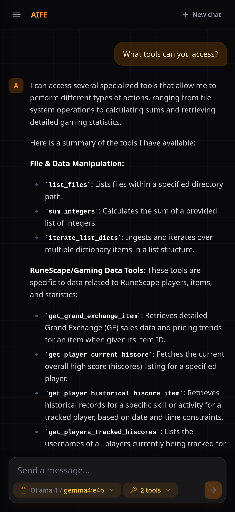

# AIFE

A web-based AI chat frontend that connects to AIA (https://github.com/Toasted-ctrl/ai_api) API. Supports multiple AI providers and models, MCP tool calling, and a personal vector store for files and memories.

## Features

- **Multi-provider chat** — stream responses from configurable AI providers and models with adjustable parameters (temperature, top-k, top-p).
- **MCP tool use** — select and invoke MCP tools during conversations, with inline display of tool calls and results.
- **Vector store** — upload documents (PDF, DOCX, TXT, MD, CSV) or save text memories to a per-user vector store for retrieval-augmented generation.
- **Google login** — authentication via Google OAuth.
- **Settings** — manage provider API keys and model preferences.



## Tech stack

React 19, TypeScript, Tailwind CSS v4, Vite, React Router.

## Getting started

### Prerequisites

- Node.js 22+
- An API key for the AIA backend

### Development

```sh
npm install
cp .env.example .env   # add your VITE_API_KEY
npm run dev
```

The dev server starts at `http://localhost:5173`.

### Build

```sh
npm run build
npm run preview
```

### Lint

```sh
npm run lint
```

## Docker

The app ships as an nginx-based container. The `VITE_API_KEY` is injected at runtime via the entrypoint script, so the same image works across environments.

```sh
docker build -t aife .
docker run -p 8080:80 -e VITE_API_KEY=sk_live_... aife
```

A Kubernetes deployment is available under `k8s/`.

## Project structure

```
src/
├── components/      UI components (header, chat input, selectors, file upload)
├── features/auth/   Google OAuth login
├── pages/           Route pages (chat, login, settings, documents)
└── services/        API clients (streaming, vector store, providers, documents)
```

## Environment variables

| Variable | Description |
|---|---|
| `VITE_API_KEY` | AIA API key, used for all backend requests |
